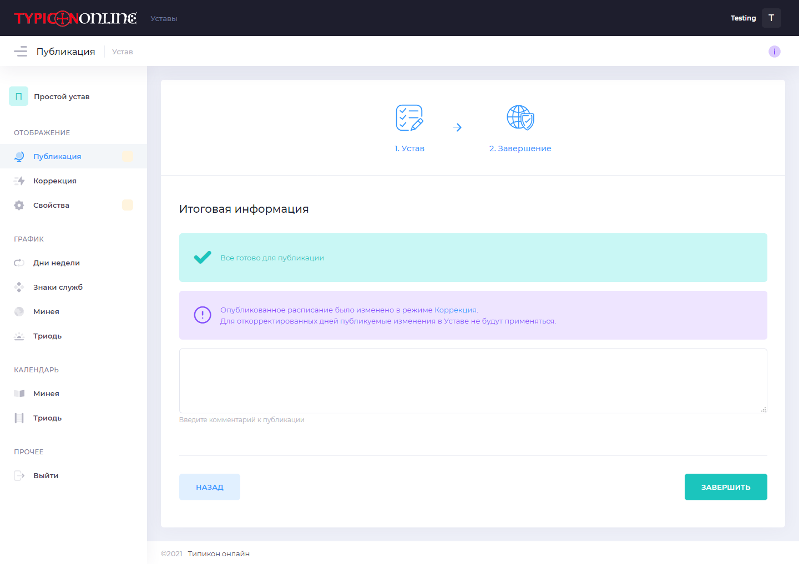

Коррекция и публикация
----------------------

Анонс
~~~~~

В этом уроке мы познакомимся с панелью управления Устава и научимся публиковать изменения.

Панель управления
~~~~~~~~~~~~~~~~~

Открываем наш Устав и нам открывается Панель управления:

.. figure:: 1.png
	:width: 300 px
	:alt: Панель управления

Слева располагается меню с всеми разделами Устава. Кликая на них, мы переходим в соответствующие разделы. Если вы будете пользоваться мобильной версией, то это меню доступно при нажатии на кнопку |кнопочка|. 

Давайте разберемся с верхним рядом элементов: это свойства Устава, публикация и коррекция. Обо всем по порядку.

Свойства Устава
~~~~~~~~~~~~~~~

На этой карточке Отображается ранее введенные нами Наименование Устава, его описание, а также дата создания и последней публикации.
Ниже строка с настройками - она пустая в нашем случае. Если у Устава активирована возможность печатать расписание или он имеет расширенный вид отображения - это будет отображаться здесь особыми значками. Но об этом мы будем говорить в следующих уроках.

Нажмем на три точки в правом верхнем углу карточки свойств Устава и выберем действие "Редактировать". После этого нам откроется страница редактирования свойств Устава.

.. figure:: 2.png
	:width: 300 px
	:alt: Свойства Устава

Первые два поля нам знакомы: наименование и описание. Можно их изменить.

Далее мы можем включить **полный вид** отображения графика богослужений. Это даст возможность редактировать порядок богослужений с условиями и различными другими функциями. Об этой возможности будет рассказано в следующих уроках. Пока оставим как есть.

Также здесь можно включить вывод расписания на печать. Ведь нам нужна не только электронная версия, мы печатаем расписание для размещения на стендах на территории храмов и монастырей. 
Эта возможность уже реализована для вас. Можно включить этот режим, и после публикации изменений на странице просмотра расписания появится кнопка "Скачать". Нажимая ее, вы будете получать расписание на неделю в формате word-документа. Его кстати можно настроить полностью под ваши нужды. Поговорим об этом в следующих уроках.

Ну что же, давайте тем не менее внесем какие-нибудь изменения в свойства. Допустим, изменим Наименование.

Жмем кнопку сохранить и возвращаемся на Панель Устава. 

На карточке свойств добавился желтый маркер. Это значит, что изменения были внесены. Но если мы перейдем на страницу просмотра расписания, то изменений мы не увидим.
Дело в том, что изменения должны быть еще опубликованы. Формирование расписания является весьма производительной операцией для системы, и поэтому мы реализовали пакетное обновление изменений, а также возможность отмены внесенных изменений. 

То есть, все изменения, которые вы делаете в Уставе могут быть отменены. Сейчас мы это и проверим. 

Выбираем на карточке свойств Устава действие "Отменить". Система спросит у нас, действительно ли мы этого хотим.

.. figure:: 4.png
	:width: 300 px
	:alt: Отмена изменений

Нажимаем "Продолжить", и действительно - внесенные нами изменения исчезли. Подобным образом все будет происходит и с остальными элементами Устава. Если мы в чем-то ошиблись - ничего страшного, это всегда можно вернуть обратно)

Публикация
~~~~~~~~~~

В случае, если у нас никаких изменений нет, этот раздел остается не доступным. Потому как публиковать нечего.

Напротив, если мы внесли какие-то изменения, то на панели раздел "Публикация" окрашивается в желтый цвет. Никакой опасности или ошибки не произошло - просто мы должны знать, что в нашем Уставе имеются неопубликованные изменения.

Нажимаем на кнопку "Перейти" и нам открывается страница с таблицей, отображающей все неопубликованные изменения, сделанные нами. Каждое из них может быть отменено. 

.. figure:: 5.png
	:width: 300 px
	:alt: Публикация изменений

Переходим на следующий шаг. Итоговая информация сообщит нам о том, что все готово для публикации.

Также мы видим информационное сообщение о том, что у нас имеется коррекция, произведенная в ручном режиме. Об этом будет сказано в следующем пункте (см. п. Коррекция).

Ну а мы нажимаем на кнопку "Завершить" и наши коррективы теперь становятся опубликованными. 

Коррекция
~~~~~~~~~

Давайте теперь разберемся с коррекцией. Что это такое и как это можно использовать?

Представим ситуацию: мы создали Устав и совершили его первоначальную установку, расписание теперь опубликовано и доступно для всех. Но вдруг сложилась какая-либо ситуация, и нам нужно внести коррективы в расписание. Причем точечно, только на этот день - в следующем году эти изменения не должны отображаться. Например, заболел священник и службы необходимо отменить или в этот день нужно поменять время богослужения.

Как раз для таких целей и существует раздел "Коррекция".

Нажимая на кнопки редактирования (отмечены на снимке), мы можем скорректировать свойства как отдельного богослужения, так и названия богослужебного дня.

Напротив каждого богослужения справа от кнопки редактирования размещается переключатель. Если он серого цвета, значит служба отображается в опубликованной версии расписания. Если нажать на него, он окрасится в красным цвет, а сама служба будет исключена из опубликованной версии расписания.

Можно это проверить. Допустим, по какой-то причине нам нужно отменить всенощное бдение 20 марта накануне  воскресного дня. Нажимаем на переключатель.

.. figure:: 8.png
	:width: 300 px
	:alt: Отмена службы

Теперь служба отменена, а если мы посмотрим опубликованное расписание, то всенощной там уже не будет:

.. figure:: 9.png
	:width: 300 px
	:alt: Скорректированное расписание

Все измененные элементы окрашены желтым цветом. И все изменения можно также отменить. 

.. figure:: 10.png
	:width: 300 px
	:alt: Отмена изменений

Нажимаем на кнопку "Отменить" (она кстати подсвечивает все изменения, которые могут быть отменены с помощью нее) и система сформирует заново расписание на этот день согласно общим правилам Устава.

