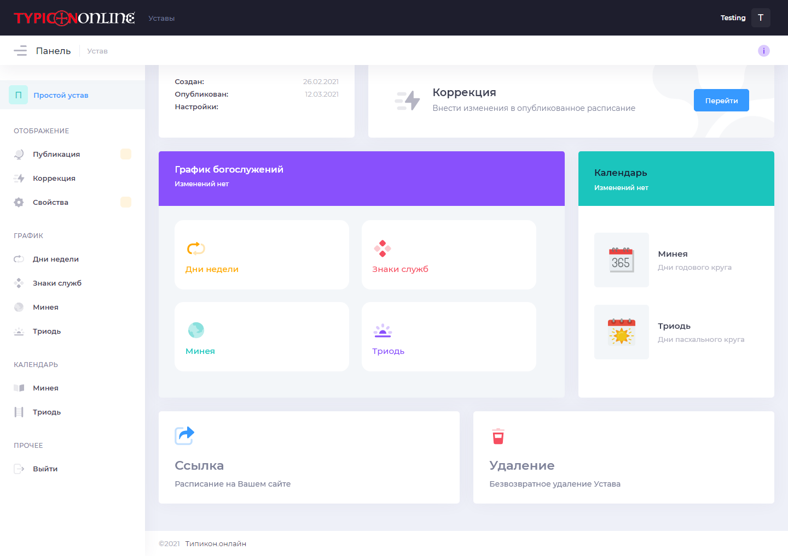
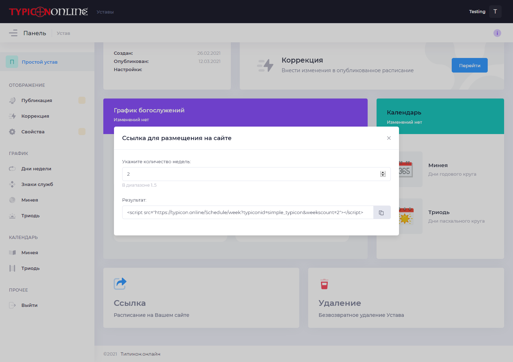

Размещение расписания на Вашем сайте
------------------------------------

Анонс
~~~~~

Давайте наконец разместим расписание на Вашем сайте, чтобы ваши прихожане всегда могли пользоваться актуальной версией расписания на ближайшее время.

Размещение
~~~~~~~~~~

Урок будет коротким. Заходим в режим редактирования на главную панель нашего Устава.

В самом низу найдем на элемент "Ссылка - расписание на Вашем сайте" и кликнем на него. Откроется форма генерации ссылки для вставки на сайт:

Мы можем здесь выбрать количество недель, которое будет отображаться на вашем сайте. Возможные варианты от 1 до 5 недель.

*Примечание:*

Мы указываем количество недель с порядком богослужений, которое точно будет отображено нашем сайте. То есть если служба совершается у нас только в двунадесятые праздники (которые случаются не так часто), а мы указали в форме генерации ссылки 3 недели, то система будет выдавать расписание с двумя неделями, в которых есть богослужения. Допустим в августе для 19 и 28 чисел, а затем уже для 21 сентября.

Внизу в поле "Результат" мы видим строчку кода, которую нужно вставить в нужно место на html-странице вашего сайта.

Если ваш сайт работает на Wordpress или других системах управления содержимым сайтов, то это также является возможным.
